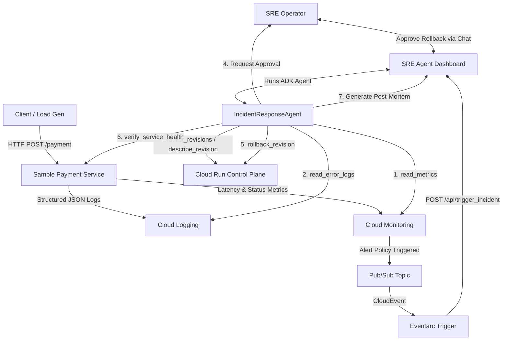

# System Architecture

This document describes the architectural layout of the **Autonomous Incident Response Agent on Google Cloud** demo.

## Overview
The solution comprises two main components:
1. **Sample Payment Service**: A microservice that acts as the target system under management. It contains an intentional configuration vulnerability toggled via `ENABLE_BAD_CONFIG=true`.
2. **AI SRE Agent Dashboard (Operations Center)**: A FastAPI + HTMX application displaying real-time monitoring telemetry, logs, active incidents, AI reasoning panels, operator chat console, and automated remediation status.

## Component Architecture

The diagram below shows how the components interact in a production GCP deployment:

## Key Workflows

### 1. Telemetry and Ingestion Pipeline
- **Logs**: The payment service outputs structured JSON logs containing request IDs, trace IDs, revision names, regions, and severities directly to stdout, which Cloud Logging ingests.
- **Metrics**: Cloud Monitoring gathers metrics on CPU, Memory, Request Rates, Latencies, and HTTP status codes (2xx/5xx).
- **Alert Policy**: An alert policy is configured in Cloud Monitoring to track 5xx error counts. When failures exceed the threshold, the alert fires.

### 2. Autonomous Triage and Human-in-the-Loop Remediation
- **Event Forwarding**: Eventarc forwards the alert payload to the dashboard backend.
- **Agent Activation**: The `IncidentResponseAgent` is initialized via Google ADK.
- **Triage**:
  - The agent queries Cloud Monitoring for error rates.
  - The agent queries Cloud Logging to extract exception messages (e.g. `MISSING_PAYMENT_KEY`).
  - The agent queries Cloud Run to list active revisions and inspects their environment variables, finding `ENABLE_BAD_CONFIG=true` on revision `v15`.
- **RCA generation**: The agent synthesizes this data using Gemini 2.5 Flash and outputs an Observed Symptoms, Evidence, Reasoning, and Remediation Plan.
- **Approval Gate**: The agent posts a message to the SRE chat room asking for approval to rollback. The state machine transitions to `Waiting Approval`.
- **Execution & Verification**: Once approved:
  - The agent updates the traffic split to route 100% of traffic to the previous healthy revision (`v14`).
  - The agent calls the health check endpoint to verify recovery.
  - The agent compiles an Incident Report (Post-Mortem) in Markdown.
