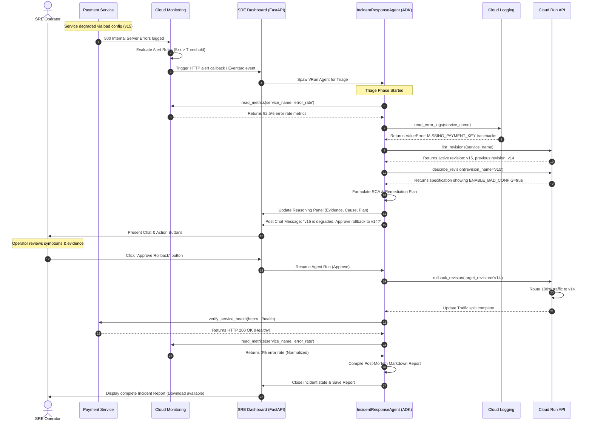

# System Workflow Sequence

This document describes the execution sequence of an incident response workflow.

## Detailed Stage Analysis

1. **Triggering**: A deployment of a bad revision (represented by `sample-payment-service-v15` containing `ENABLE_BAD_CONFIG=true`) causes payment calls to fail. High rates of 500 errors trigger a Cloud Monitoring Alert policy.
2. **Alert Ingestion**: In production, the alert is sent to a Pub/Sub topic and then routed via Eventarc as a webhook call to `/api/trigger_incident` on the dashboard.
3. **Automated Triage**: The ADK agent executes a series of parallelized/sequential tool calls to collect telemetry. It reasons about this telemetry, discovering the `MISSING_PAYMENT_KEY` environment configuration problem.
4. **Human Gate**: The dashboard locks into the `Waiting Approval` state, displaying the operator chat message and the reasoning panel. The agent halts tool execution until input is provided.
5. **Remediation**: The operator clicks approve, releasing the agent to perform the update. It routes traffic back to `v14` and tests the health endpoint.
6. **Report Compilation**: The agent compiles the post-mortem document and pushes it to the dashboard. The dashboard saves the report, transitions to `Closed`, and updates the UI.
